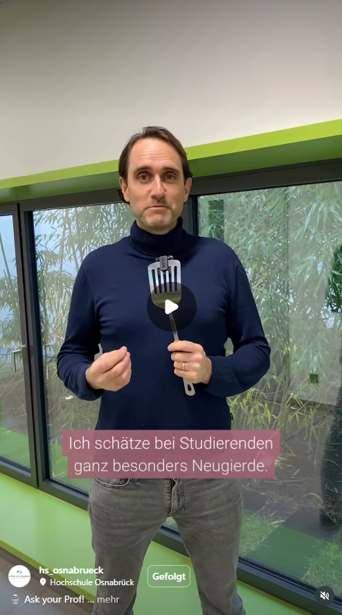

Thanks for visiting my academic website. I am a professor at the University of Applied Sciences Osnabrück. I hope you find the information you are looking for. If not, please feel free to contact me.

## What I’m up to

I was recently interviewed in “Ask your Prof!” format. Click on the image to view it on Instagram.

## Latest Project: FLEX³

I am curious about how AI can help make teaching more accessible and inclusive. Starting in fall 2026, I will explore this topic in the project **FLEX³**, funded by the [Flexcellence Program](https://www.hs-osnabrueck.de/texas/teilprojekte/flexcellence/) of the University of Applied Sciences Osnabrück.

One goal of this project is to create different AI-dubbed versions of the same lecture recording. The two videos below show an example from a Science Slam I held in 2025. The version on the left is the original German version, while the version on the right is an English dub created with [ElevenLabs.io](http://elevenlabs.io/). The videos are available on YouTube.

**German version (original)**

# Ein Fehler ist aufgetreten.

JavaScript kann nicht ausgeführt werden.

**English version**

# Ein Fehler ist aufgetreten.

JavaScript kann nicht ausgeführt werden.
