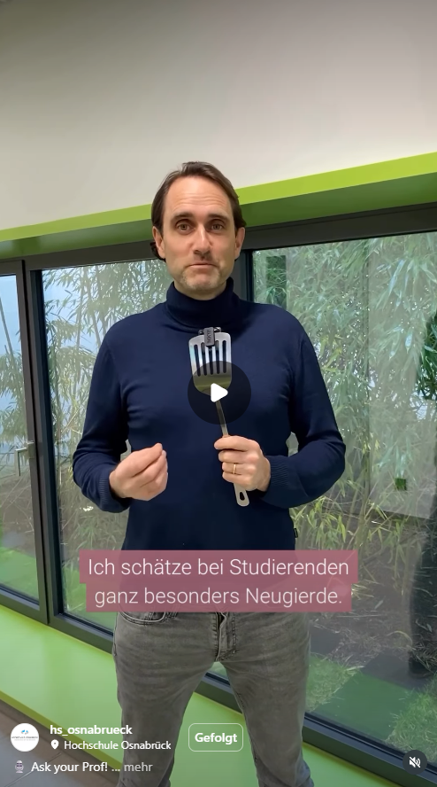

Thanks for visiting my academic website. I am a professor at the University of Applied Sciences Osnabrück. I hope you find the information you are looking for. If not, please feel free to contact me.

## What I’m up to

I was recently interviewed in “Ask your Prof!” format. Click on the image to view it on Instagram.

## A Teaser for the LiFi Project

In our first-semester module *Digitization and Programming*, students build a small device that sends a file from one laptop to another with nothing but light. This short teaser introduces the project, and it is my first attempt at a video that is entirely computer-animated: Claude Opus 5.5 wrote the code that draws every frame, while the voice, the music and the parrot artwork were generated with other AI tools.

Everything about the project is on the [course website](https://docs.lifi-project.de/).

## Latest Project: FLEX³

I am curious about how AI can help make teaching more accessible and inclusive. In October 2026, I started exploring this topic in the project **FLEX³**, funded by the Flexcellence program of the University of Applied Sciences Osnabrück. [Learn more on the official project page](https://www.hs-osnabrueck.de/texas/teilprojekte/flexcellence/).

One goal of this project is to create different AI-dubbed versions of the same lecture recording. The two videos below show an example from a Science Slam I held in 2025. The version on the left is the original German version, while the version on the right is an English dub created with [ElevenLabs.io](http://elevenlabs.io/). The videos are available on YouTube.

**German version (original)**

# Ein Fehler ist aufgetreten.

JavaScript kann nicht ausgeführt werden.

**English version**

# Ein Fehler ist aufgetreten.

JavaScript kann nicht ausgeführt werden.
